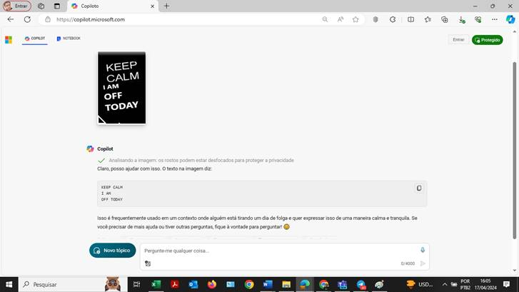
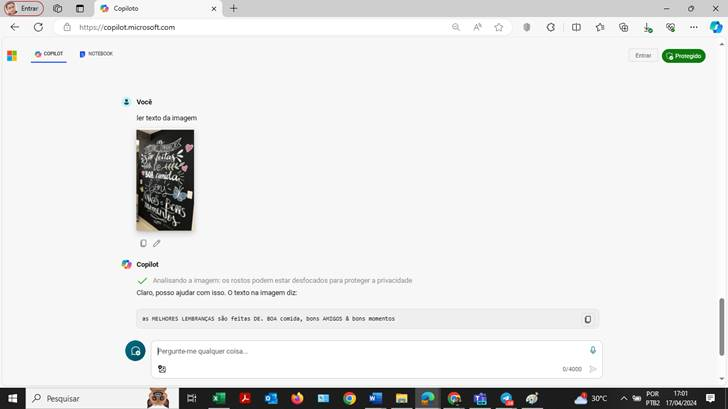

<head>

</head>

<body lang=PT-BR style='tab-interval:35.4pt'>

<b>1. Introdu��o � IA
Generativa</b>&nbsp;A IA generativa é uma subcategoria da inteligêcia artificial que
treina modelos para gerar conteúdo. Isso pode incluir texto, imagens, música e
muito mais. O Copilot da OpenAI
é um exemplo de um modelo de IA generativa.<o:p></o:p>

<b>2. Configurando o
Ambiente</b>&nbsp;Antes de começar, você precisaré configurar o ambiente de
desenvolvimento. Isso pode incluir a instalaçãoo de bibliotecas de IA
necessárias..<o:p></o:p>

<b>3. Usando o Copilot</b>&nbsp;O Copilot pode
ajudar a gerar código, responder perguntas e muito mais. Para começar a usar o Copilot, voc� pode simplesmente começar a digitar em seu
editor de código e o Copilot oferecerá sugestões.<o:p></o:p>

<b>4. Reconhecimento
de Texto em Imagens</b>&nbsp;O reconhecimento de texto em imagens � um recurso poderoso que
pode ser alcançado através de tecnicas de IA. Existem várias bibliotecas
disponíveis para isso, como Tesseract e OpenCV. Aqui estao os passos basicos:<o:p></o:p>

<b>4.1 Importa��o da
Biblioteca</b>: Primeiro, importe a biblioteca necessaria para o reconhecimento de
texto em imagens.<o:p></o:p>

<b>4.2 Carregamento da
Imagem</b>: Carregue a imagem da qual você deseja extrair o texto.<o:p></o:p>

<b>4.3
Pré-processamento da Imagem</b>: Isso pode incluir a conversão da imagem para
escala de cinza, aplicação de limiar, etc.<o:p></o:p>

<b>4.4 Reconhecimento
de Texto</b>: Finalmente, aplique a funcao de reconhecimento de texto na imagem pré-processada.<o:p></o:p>

<b>5. Explorando
Possibilidades</b>&nbsp;Com a IA generativa, as possibilidades sao quase infinitas. Voc�
pode gerar novos conteudos, automatizar tarefas, melhorar a eficiencia do
código e muito mais.<o:p></o:p>

<b>6. Conclusão</b>&nbsp;A IA generativa � uma ferramenta poderosa com muitas aplicações.
Com o Copilot e o OpenAI,
você pode explorar essas possibilidades e levar seus projetos para o próximo
nível.<o:p></o:p>

<o:p>&nbsp;</o:p>

Segue alguns exemplos de testes aplicados<o:p></o:p>

 

<ol style='margin-top:0cm' start=1 type=1>
 <li class=MsoNormal style='mso-list:l0 level1 lfo2'>IMAGEM COM BACKUGROUND<o:p></o:p></li>
</ol>

<!--[if gte vml 1]><v:shapetype id="_x0000_t75" coordsize="21600,21600"
 o:spt="75" o:preferrelative="t" path="m@4@5l@4@11@9@11@9@5xe" filled="f"
 stroked="f">
 <v:stroke joinstyle="miter"/>
 <v:formulas>
  <v:f eqn="if lineDrawn pixelLineWidth 0"/>
  <v:f eqn="sum @0 1 0"/>
  <v:f eqn="sum 0 0 @1"/>
  <v:f eqn="prod @2 1 2"/>
  <v:f eqn="prod @3 21600 pixelWidth"/>
  <v:f eqn="prod @3 21600 pixelHeight"/>
  <v:f eqn="sum @0 0 1"/>
  <v:f eqn="prod @6 1 2"/>
  <v:f eqn="prod @7 21600 pixelWidth"/>
  <v:f eqn="sum @8 21600 0"/>
  <v:f eqn="prod @7 21600 pixelHeight"/>
  <v:f eqn="sum @10 21600 0"/>
 </v:formulas>
 <v:path o:extrusionok="f" gradientshapeok="t" o:connecttype="rect"/>
 <o:lock v:ext="edit" aspectratio="t"/>
</v:shapetype><v:shape id="Imagem_x0020_1" o:spid="_x0000_i1087" type="#_x0000_t75"
 style='width:546pt;height:306.75pt;visibility:visible;mso-wrap-style:square'>
 <v:imagedata src="assets/image001.png"
  o:title=""/>
</v:shape><![endif]--><![if !vml]><![endif]><o:p></o:p>

<o:p>&nbsp;</o:p>

<ol style='margin-top:0cm' start=2 type=1>
 <li class=MsoNormal style='mso-list:l0 level1 lfo2'>IMAGEM COM FUNDO PRETO E FORA DE
     ALINHAMENTO<o:p></o:p></li>
</ol>

<!--[if gte vml 1]><v:shape id="_x0000_i1088" type="#_x0000_t75"
 style='width:545.25pt;height:306.75pt'>
 <v:imagedata src="assets/image003.png"
  o:title=""/>
</v:shape><![endif]--><![if !vml]><![endif]><o:p></o:p>

<ol style='margin-top:0cm' start=3 type=1>
 <li class=MsoNormal style='mso-list:l0 level1 lfo2'>IMAGEM DE UMA FOTO REAL<o:p></o:p></li>
</ol>

<o:p>&nbsp;</o:p>

<!--[if gte vml 1]><v:shape id="_x0000_i1089" type="#_x0000_t75"
 style='width:546pt;height:306.75pt;visibility:visible;mso-wrap-style:square'>
 <v:imagedata src="assets/image005.png"
  o:title=""/>
</v:shape><![endif]--><![if !vml]><![endif]><o:p></o:p>

</body>

</html>
