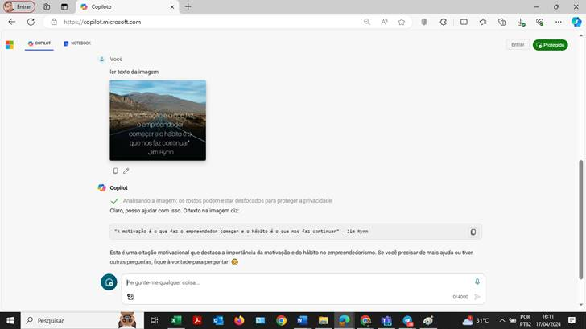

# Explorando a IA generativa com o Microsoft Copilot

---

A IA generativa é uma subcategoria da inteligência artificial que treina modelos para gerar conteúdo. Isso pode incluir texto, imagens, música e muito mais. O Azure AI é um exemplo de um modelo de IA generativa que pode gerar código, responder perguntas e muito mais.

## Configurando o Ambiente Azure

Antes de começar a usar a IA generativa ou o Azure AI, você precisará configurar o ambiente de desenvolvimento no Azure. Isso pode incluir a instalação de bibliotecas de IA necessárias, como Azure Machine Learning, Azure Cognitive Services, etc.

## Usando a IA generativa

A IA generativa pode ajudar a gerar código, responder perguntas e muito mais. Para começar a usar o Azure AI, você pode simplesmente começar a digitar em seu editor de código e o Azure AI oferecerá sugestões com base no contexto do seu código.

## Reconhecimento de Texto em Imagens

O reconhecimento de texto em imagens é um recurso poderoso que pode ser alcançado através de técnicas de IA. O Azure Computer Vision é uma ferramenta disponível para isso. Aqui estão os passos básicos:

1. **Importação da Biblioteca**: Primeiro, importe a biblioteca necessária para o reconhecimento de texto em imagens. Por exemplo, `from azure.cognitiveservices.vision.computervision import ComputerVisionClient`.

2. **Carregamento da Imagem**: Carregue a imagem da qual você deseja extrair o texto.

3. **Pré-processamento da Imagem**: Isso pode incluir a conversão da imagem para escala de cinza, aplicação de limiar, etc., para melhorar a precisão do reconhecimento de texto.

4. **Reconhecimento de Texto**: Finalmente, aplique a função de reconhecimento de texto na imagem pré-processada. Por exemplo, `text = client.recognize_printed_text_in_stream(image)`.

## Conclusão

A IA generativa é uma ferramenta poderosa com muitas aplicações. Com o Copilot e o OpenAI, você pode explorar essas possibilidades e levar seus projetos para o próximo nível. Continue aprendendo e experimentando!

Segue alguns exemplos de testes aplicados<o:p></o:p>

 

<ol style='margin-top:0cm' start=1 type=1>
 <li class=MsoNormal style='mso-list:l0 level1 lfo2'>IMAGEM COM BACKUGROUND<o:p></o:p></li>
</ol>

<!--[if gte vml 1]><v:shapetype id="_x0000_t75" coordsize="21600,21600"
 o:spt="75" o:preferrelative="t" path="m@4@5l@4@11@9@11@9@5xe" filled="f"
 stroked="f">
 <v:stroke joinstyle="miter"/>
 <v:formulas>
  <v:f eqn="if lineDrawn pixelLineWidth 0"/>
  <v:f eqn="sum @0 1 0"/>
  <v:f eqn="sum 0 0 @1"/>
  <v:f eqn="prod @2 1 2"/>
  <v:f eqn="prod @3 21600 pixelWidth"/>
  <v:f eqn="prod @3 21600 pixelHeight"/>
  <v:f eqn="sum @0 0 1"/>
  <v:f eqn="prod @6 1 2"/>
  <v:f eqn="prod @7 21600 pixelWidth"/>
  <v:f eqn="sum @8 21600 0"/>
  <v:f eqn="prod @7 21600 pixelHeight"/>
  <v:f eqn="sum @10 21600 0"/>
 </v:formulas>
 <v:path o:extrusionok="f" gradientshapeok="t" o:connecttype="rect"/>
 <o:lock v:ext="edit" aspectratio="t"/>
</v:shapetype><v:shape id="Imagem_x0020_1" o:spid="_x0000_i1087" type="#_x0000_t75"
 style='width:546pt;height:306.75pt;visibility:visible;mso-wrap-style:square'>
 <v:imagedata src="assets/image001.png"
  o:title=""/>
</v:shape><![endif]--><![if !vml]><![endif]><o:p></o:p>

<o:p>&nbsp;</o:p>

<ol style='margin-top:0cm' start=2 type=1>
 <li class=MsoNormal style='mso-list:l0 level1 lfo2'>IMAGEM COM FUNDO PRETO E FORA DE
     ALINHAMENTO<o:p></o:p></li>
</ol>

<!--[if gte vml 1]><v:shape id="_x0000_i1088" type="#_x0000_t75"
 style='width:545.25pt;height:306.75pt'>
 <v:imagedata src="assets/image003.png"
  o:title=""/>
</v:shape><![endif]--><![if !vml]><![endif]><o:p></o:p>

<ol style='margin-top:0cm' start=3 type=1>
 <li class=MsoNormal style='mso-list:l0 level1 lfo2'>IMAGEM DE UMA FOTO REAL<o:p></o:p></li>
</ol>

<o:p>&nbsp;</o:p>

<!--[if gte vml 1]><v:shape id="_x0000_i1089" type="#_x0000_t75"
 style='width:546pt;height:306.75pt;visibility:visible;mso-wrap-style:square'>
 <v:imagedata src="assets/image005.png"
  o:title=""/>
</v:shape><![endif]--><![if !vml]><![endif]><o:p></o:p>

</body>

</html>
